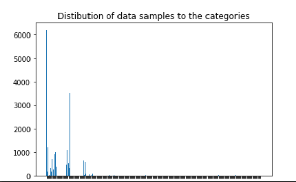

# Category-Prediction

# Pre-processing and Visualization of Data

1. Description was cleaned, unuseful symbols and characters were removed
2. Primary Category was extracted from the product category tree
3. After extracting the Primary Category, 266 unique categories were obtained with a very uneven distribution.

4. For training purposes, the no. of categories were reduced. It was done in th following way: 

a. Only those categories were kept which had samples more than 100. This gave 18 categories in total and the distribution was as shown.

b. Only those categories were kept which had samples more than 10. This gave 27 categories in total and the distribution was as shown.

5. To make the data balanced oversampling techniques were used, whose results are also discussed below.
6. Tf-IDF matrix was obtained for the cleaned data for ML models.
7. The text was tokenized and converted into high-dimensional word embeddings to be fed into DL models.

# Approaches

ML Models : The following Machine Learning models were used with input in the form of Tf-IDF. 

1. Naive Bayes 
2. Support Vector Machine 
3. Logistic Regression 

CNN : CNN’s are one of the widely used networks because of its capability to capture the spatial patterns. In NLP, CNN’s are well able to look for n-grams in the data. I have used word Embeddings as the input to the CNN model, on which a CNN layer is used. To reduce the dimensions and to ensure that only important information is passed to the next dense layers for classification a mapool layer is added. Hyperparameter Tuning was done for the embedding dimension, kernel size, filter numbers, dropout ratio and batch size.

LSTM : In Natural Language, it is the Sequential Arrangement of the words that give meaning to the text. LSTM are one of the most popularly enjoyed networks used in the text classification to capture the sequence of the text. I have used the Bidirectional LSTM (BiLSTM), which generally gives superior results than ordinary LSTM by capturing the sequences in the backward direction in addition to the forward direction. The output from the BiLSTM network is passed to the dense layer for classification. 

C-LSTM : C-LSTM models take advantage of both CNN and BiLSTM networks. A CNN layer followed by the BiLSTM is used here. In this model, spatial patterns extracted using the CNN are passed to the BiLSTM, enabling it to capture the sequence on a broader view. 

Very Deep CNN (VDCNN) : In Computer Vision, deeper CNNs have been advantageous in classification tasks. Some works using the same have also been done for classification tasks in NLP. I have implemented  Deep CNN models of varying depth, and have analysed their performance. As the network goes deeper, it becomes harder to train because of the vanishing gradient problem, and hence there is a need for larger datasets, and this requires more training time. A residual connection can help in maintaining the flow of gradients and can make the training of VDCNNs easier in case of a deficiency in training data. 
 
 
 
Multi CNN: In multi-CNNs, convolutional kernels of varying filter size are used in parallel to extract spatial information on multiple window sizes. After using multi-CNNs, outputs are concatenated and are further passed to dense layers for classification. 

Char CNN: The Character-level CNN takes input in the form of characters represented as tokens. Char CNN helps to overcome the performance loss in out-of-vocabulary cases, when there is a considerable difference in the vocabulary of training and testing data. The input tokens are first converted into their embedding form, and are then passed through a Deep CNN network for classification. 

AttBi-LSTM : AttBi-LSTM model consists of a Bidirectional LSTM network, which is followed by an attention layer. Here, the Bi-LSTM layer works like an encoder, and the return sequence is of the same length as that of the input. Attention mechanism gives attention (or weight) to the encoded sequence, which is added and passed forward to the dense layers for classification.

ARC (Attention based RCNN) :

ACBiLSTM :

HAN: Hierarchical Attention Network (HAN) works in two hierarchical phases, consisting of an AttBi-LSTM in each phase. Here, rather than passing the text directly as a sequence of words, it is passed as a sequence of sentences, which themselves are sequences of words. In the first phase, individual sentences are passed through an AttBi-LSTM unit, giving the sentences in an encoded form. This attention-weighted sum of sequences is then returned from the Bi-LSTM. Now, the encoded sentences in each text are considered as a sequence, and are passed through the second AttBi-LSTM unit. At last, dense layers are added to the model for classification.

Transformer :

Densely-connected CNN with Multi-scale feature attention: Inspired from Computer Vision tasks, this method is based upon the dense connections and attention-weighted multi-scale features. Input text is represented as a planar array, which is passed through densely-connected CNN layers to obtain multi-scale high-dimensional features. These multi-scale features are pooled down in a manner such that their dimensions become the same. The features are weighted by the attention, and are added before passing through the dense layers for classification.

 

ABCDM : Attention-based Bidirectional CNN-RNN Deep Model (ABCDM) is based on multiple techniques consisting of the following:
1. The input text sequence in the form of word embeddings is passed through a Bidirectional GRU layer and a Bidirectional LSTM layer in parallel 
2. The returned sequences from both are weighed by the attention mechanism.
3. These weighted sequences are further passed to multi-scale CNNs.
4. The output from multi-scale CNNs is down-sampled with the help of Max Pooling and Average Pooling. 
5. The pooled results are concatenated and passed through Dense layers for classification.

 Classifier based on language models : The following Language Models were used for classification task
 

1. Bert
2. Electra
3. Roberta
4. Albert

Classifier based on Capsule Network :

# Results :
For evaluation following metric were used :-
1. Accuracy
2. Precision
3. Recall
4. F1 score

Final results for classification with 18 categories.

ML models

 

Models Based on CNN and RNN

Models Based on CNN and RNN using oversampling.

Through the results it could be said that training on balanced data gave better results in term of all the performance metrics.

Models Based on Attention mechanism

Language Model based Classifier

Capsule Network based Classifier

Confusion matrix for best performing method

ROC Curve for best performing method

Final results for classification with 27 categories.

Final results for classification with 27 categories using oversampling.

# Future Works

1. A possible direction for improvement could be Data Over Sampling Techniques for Imbalanced classes. Techniques like SMOTE generates samples by averging the nearest training samples, but it was found that such techniques can't be applied to text presented through word embeddings as they carry semantic information . Generative models may help in this task.
2. Network Arhitecture with multiple techniques and Hybrid features have shown superior results. So such hyrid networks could be searched for improving performance.  
3. Graph neural networks can also be tried. Recently some work have been done on text classification using Graph Convolution Networks and Graph Attention Networks, which have shown good performance than conventional neural networks.
4. As the network goes deeper (in models like VDCNN, ABCDM) it brings the problem of vanishing gradients and it becomes worse in case of a limited training dataset. In such cases Dilated CNN could be experimented instead of CNNs, which have improved performance tremendously in computer vision applications. 
5. Building better routing algorithms in Capsule networks can also be direction for improving the performance.
6. It have been found that Memory networks can remember the sequences of larger length and hence can improve the performance for classifying the larger sequences. 

# References

1. Deep Learning Based Text Classification: A Comprehensive Review ( https://arxiv.org/pdf/2004.03705.pdf )
2. A Survey on Text Classification: From Shallow to Deep Learning  ( https://arxiv.org/pdf/2008.00364.pdf )
3. Kim, Yoon. (2014). Convolutional Neural Networks for Sentence Classification. Proceedings of the 2014 Conference on Empirical Methods in Natural Language Processing. 10.3115/v1/D14-1181. 
4. Kowsari, Kamran & Jafari Meimandi, Kiana & Heidarysafa, Mojtaba & Mendu, Sanjana & Barnes, Laura & Brown, Donald. (2019). Text Classification Algorithms: A Survey. (https://arxiv.org/pdf/1904.08067. pdf )
5. Conneau, Alexis & Schwenk, Holger & Barrault, Loïc & Lecun, Yann. (2017). Very Deep Convolutional Networks for Text Classification. 1107-1116. 10.18653/v1/E17-1104. ( https://arxiv.org/abs/1606.01781)
6. Character-level Convolutional Networks for Text Classification. ( https://arxiv.org/abs/1509.01626 )
7. Zhou, Peng & Shi, Wei & Tian, Jun & Qi, Zhenyu & Li, Bingchen & Hao, Hongwei & Xu, Bo. (2016). Attention-Based Bidirectional Long Short-Term Memory Networks for Relation Classification. 207-212. 10.18653/v1/P16-2034. 
8. Yang, Zichao & Yang, Diyi & Dyer, Chris & He, Xiaodong & Smola, Alex & Hovy, Eduard. (2016). Hierarchical Attention Networks for Document Classification. 1480-1489. 10.18653/v1/N16-1174. (https://www.cs.cmu.edu/~./hovy/papers/16HLT-hierarchical-attention-networks.pdf )
9. Vaswani, Ashish & Shazeer, Noam & Parmar, Niki & Uszkoreit, Jakob & Jones, Llion & Gomez, Aidan & Kaiser, Lukasz & Polosukhin, Illia. (2017). Attention Is All You Need.       ( https://arxiv.org/abs/1706.03762 )
10. Shiyao, Wang & Huang, Minlie & Deng, Zhidong. (2018). Densely Connected CNN with Multi-scale Feature Attention for Text Classification. 4468-4474. 10.24963/ijcai.2018/621.  ( https://www.ijcai.org/proceedings/2018/0621.pdf )
11. Basiri, Ehsan & Nemati, Shahla & Abdar, Moloud & Cambria, Erik & Acharya, U Rajendra. (2020). ABCDM: An Attention-based Bidirectional CNN-RNN Deep Model for sentiment analysis. Future Generation Computer Systems. 115. 10.1016/j.future.2020.08.005. 
12. Johnson, Rie & Zhang, Tong. (2017). Deep Pyramid Convolutional Neural Networks for Text Categorization. 562-570. 10.18653/v1/P17-1052.  ( https://riejohnson.com/paper/dpcnn-acl17.pdf )
13. Kowsari, Kamran & Heidarysafa, Mojtaba & Brown, Donald & Jafari Meimandi, Kiana & Barnes, Laura. (2018). RMDL: Random Multimodel Deep Learning for Classification. 19-28. 10.1145/3206098.3206111. ( https://arxiv.org/pdf/1805.01890 )
14. “Deep pyramid convolutional neural networks for text categorization,” in Proceedings of the 55th Annual Meeting of the Association
for Computational Linguistics (Volume 1: Long Papers), 2017, pp. 562–570
15. W. Yin, H. Schütze, B. Xiang, and B. Zhou, “Abcnn: Attention-based convolutional neural network for modeling sentence pairs,” Transactions of the Association for Computational Linguistics, vol. 4, pp. 259–272, 2016.
16. L. Yao, C. Mao, and Y. Luo, “Graph convolutional networks for text classification,” in Proceedings of the AAAI Conference on Artificial
Intelligence, vol. 33, 2019, pp. 7370–7377
17. C. Zhou, C. Sun, Z. Liu, and F. Lau, “A c-lstm neural network for text classification,” arXiv preprint arXiv:1511.08630, 2015
18.  Y. Liu, M. Ott, N. Goyal, J. Du, M. Joshi, D. Chen, O. Levy, M. Lewis, L. Zettlemoyer, and V. Stoyanov, “Roberta: A robustly optimized
bert pretraining approach,” arXiv preprint arXiv:1907.11692, 2019
19. Z. Lan, M. Chen, S. Goodman, K. Gimpel, P. Sharma, and R. Soricut, “Albert: A lite bert for self-supervised learning of language
representations,” arXiv preprint arXiv:1909.11942, 2019.
20. K. Clark, M.-T. Luong, Q. V. Le, and C. D. Manning, “Electra: Pre-training text encoders as discriminators rather than generators,” arXiv
preprint arXiv:2003.10555, 2020.
21. Efficient Transformers: A Survey (https://arxiv.org/abs/2009.06732)

22. https://scikit-learn.org/

23. https://keras.io/

24. https://www.tensorflow.org/

25. https://huggingface.co/transformers/

26. https://github.com/gentaiscool/lstm-attention

27. https://github.com/moloud1987/ABCDM

28. https://github.com/arunarn2/HierarchicalAttentionNetworks

29. https://github.com/TeamLab/text-capsule-network

30. https://github.com/chaitjo/character-level-cnn
31. https://machinelearningmastery.com/develop-n-gram-multichannel-convolutional-neural-network-sentiment-analysis/
32. https://towardsdatascience.com/social-media-sentiment-analysis-part-ii-bcacca5aaa39

